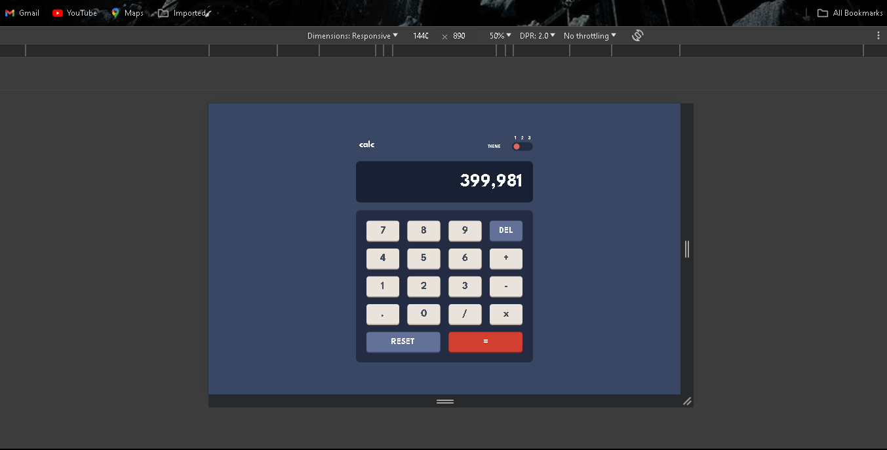
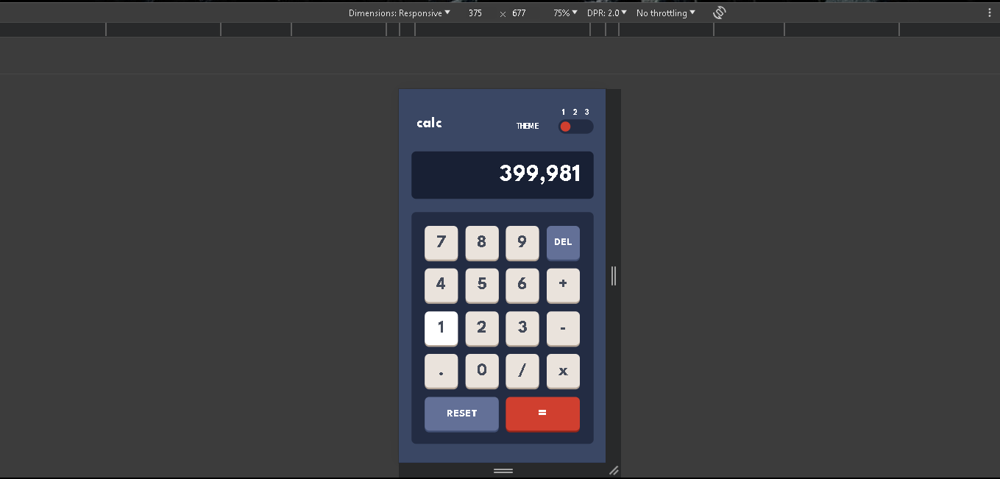

# Frontend Mentor - Calculator app solution

This is a solution to the [Calculator app challenge on Frontend Mentor](https://www.frontendmentor.io/challenges/calculator-app-9lteq5N29). Frontend Mentor challenges help you improve your coding skills by building realistic projects.

## Table of contents

- [Overview](#overview)
  - [The challenge](#the-challenge)
  - [Screenshot](#screenshot)
  - [Links](#links)
- [My process](#my-process)
  - [Built with](#built-with)
- [Author](#author)
- [Acknowledgments](#acknowledgments)

## Overview

### The challenge

Users should be able to:

- See the size of the elements adjust based on their device's screen size
- Perform mathmatical operations like addition, subtraction, multiplication, and division
- Adjust the color theme based on their preference
- **Bonus**: Have their initial theme preference checked using `prefers-color-scheme` and have any additional changes saved in the browser

### Screenshot




### Links

- Solution URL: [Add solution URL here](https://your-solution-url.com)
- Live Site URL: [click here](https://jithin-b-p-calculator.netlify.app/)

## My process

### Built with

- Semantic HTML5 markup
- CSS custom properties
- Flexbox
- CSS Grid
- Mobile-first workflow
- Javascript

## Author

- [Jithin B P]()
- Frontend Mentor - [@Jithin-b-p](https://www.frontendmentor.io/profile/Jithin-b-p)
- twitter - [@b_p_jithin](https://twitter.com/b_p_jithin)

## Acknowledgments

Every npm packages used for this project is provided in the package.json
(sass, prefixer and compress)

- Install them:

```bash
npm install
```

- For compiling and testing run this command from the command line inside the root folder:

```bash
npm run watch:sass
```

Scripts are provided along with the package.json do checkout and custom your own.
